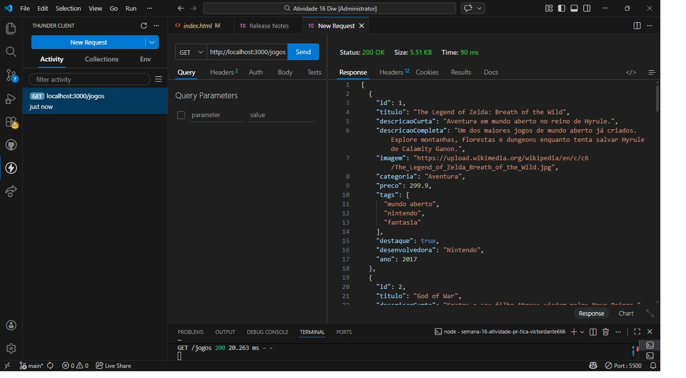
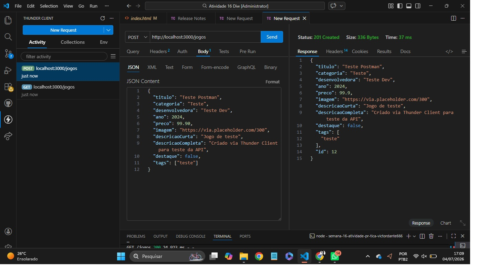
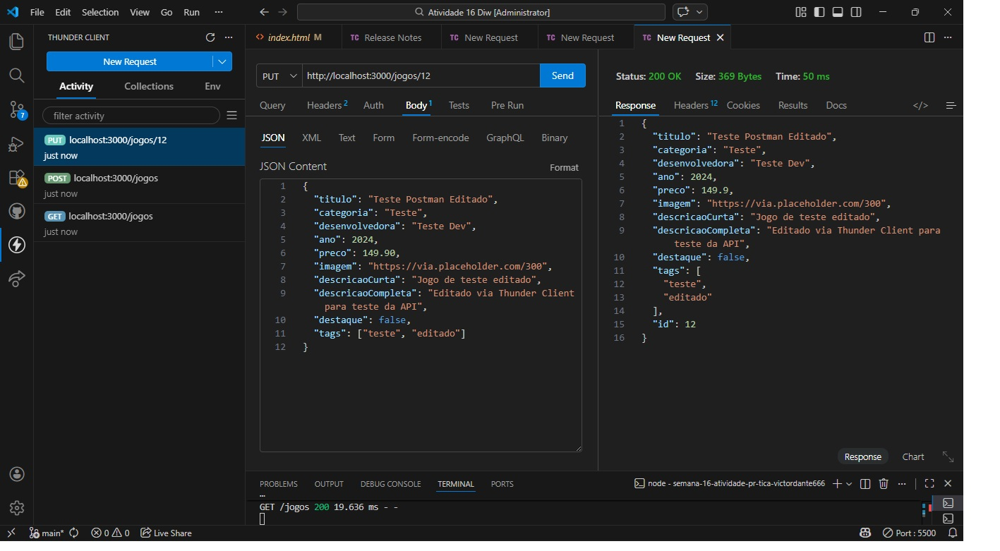
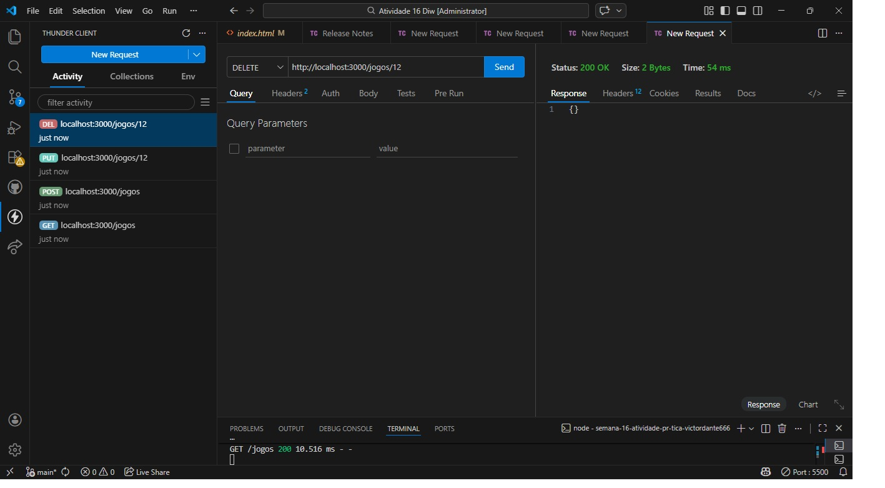
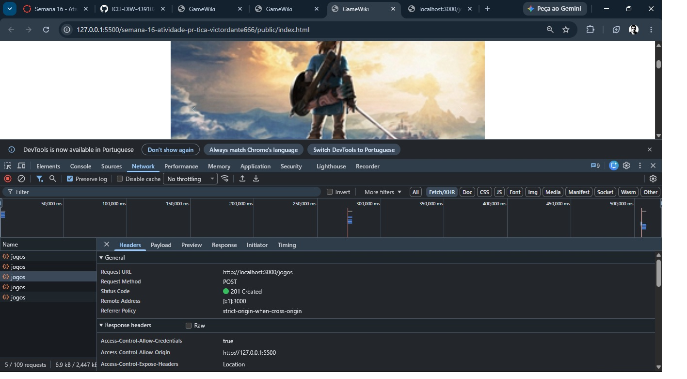

# Trabalho Prático - Semana 16

## Informações do trabalho

- **Nome:** Victor Dante Fonseca Oliveira
- **matricula**909385
- **Curso:** Engenharia de Software — PUC Minas
- **Projeto escolhido:** GameWiki — catálogo de jogos com CRUD completo

## Descrição do projeto

A GameWiki é uma aplicação web que lista jogos em destaque (carrossel) e um catálogo completo de jogos, permitindo visualizar detalhes, adicionar novos jogos, editar informações e excluir registros. Os dados são consumidos via API REST fake gerada pelo JSON Server, com todas as operações (GET, POST, PUT, DELETE) feitas através de fetch().

## Ferramentas empregadas

- **Node.js** (plataforma de execução JavaScript no servidor)
- **JSON Server** (servidor fake REST API)
- **Thunder Client** (extensão VS Code para testes de requisições)
- **API Fetch** (para consumo da API)
- **Visual Studio Code**
- **Git/GitHub** (controle de versão)
- **Bootstrap 5** (estilização da interface)

## Etapa 1 — Estruturação do ambiente de desenvolvimento

Ambiente configurado com Node.js e JSON Server, seguindo a estrutura de pastas:

db/db.json
public/index.html
public/detalhes.html
public/assets/css/styles.css
public/assets/scripts/app.js
public/assets/scripts/detalhes.js

## Etapa 2 — Montagem da estrutura de dados e teste da API do JSONServer

O arquivo db/db.json contém a entidade jogos, com mais de 3 registros (10 jogos cadastrados), incluindo título, categoria, desenvolvedora, ano, preço, imagem, tags e descrições.

Testes realizados com Thunder Client em http://localhost:3000/jogos:

**GET** — listar todos os jogos

**POST** — criar um novo jogo

**PUT** — editar um jogo existente

**DELETE** — excluir um jogo

## Etapa 3 — Implementação das funcionalidades dinâmicas e CRUD via JSONServer

As páginas index.html e detalhes.html, junto com os scripts app.js e detalhes.js, foram implementadas para consumir os dados via API Fetch, substituindo o uso de dados fixos em variável JavaScript.

Funcionalidades implementadas:
- **Listagem** dos jogos na página inicial (carrossel de destaques + grade de cards)
- **Criação** de novo jogo através de formulário na página inicial
- **Edição** de um jogo existente na página de detalhes
- **Exclusão** de um jogo tanto pela página inicial quanto pela página de detalhes

Print da aba Network do navegador mostrando a requisição Fetch (POST) feita a partir do formulário, com a confirmação de inserção do registro no db.json do JSON Server:

## Etapa 4 — Documentação do projeto

Este README documenta as etapas realizadas, ferramentas utilizadas e evidências (prints) de cada uma das operações CRUD implementadas.

## Como executar o projeto

1. Instalar as dependências:

npm install

2. Rodar o JSON Server:

npx json-server db/db.json --port 3000

3. Abrir o arquivo public/index.html no navegador (recomendado usar a extensão Live Server do VS Code)